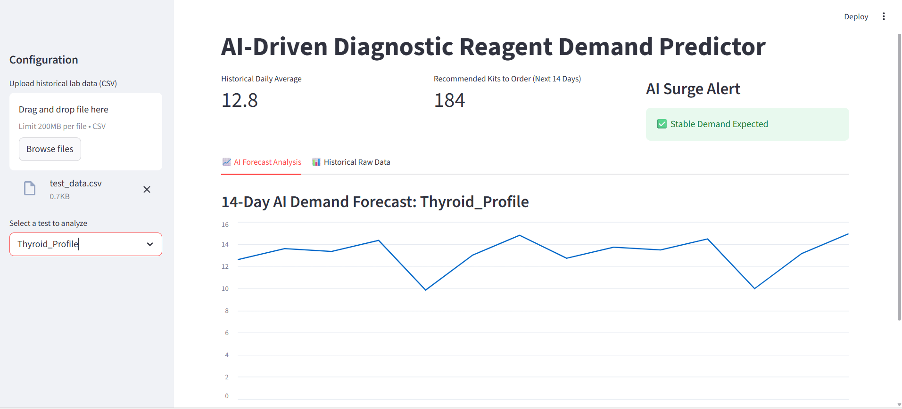

# 🧪 AI-Driven Diagnostic Reagent Demand Predictor

An AI-powered application built using **Python, Streamlit, and Facebook Prophet** to help laboratories predict future diagnostic reagent demand using historical test data.

The system analyzes past laboratory test usage and generates a **14-day demand forecast**, helping laboratories plan reagent inventory more efficiently.

---

## 🚀 Live Demo

🌐 **Try the application here:**

👉 [AI Diagnostic Reagent Demand Predictor - Live Demo](https://labreagentpredictor.streamlit.app/)

---

## 📸 Application Preview



---

## ✨ Features

- 📂 Upload historical laboratory test data using CSV
- 🔬 Select a diagnostic test for analysis
- 🤖 AI-powered demand forecasting
- 📅 14-day future demand prediction
- 📊 Interactive Streamlit dashboard
- 📈 Visualize historical and predicted demand
- 📦 Helps laboratories plan reagent inventory
- 💻 Simple and user-friendly interface

---

## 📂 Project Structure

```text
Lab-Reagent-Predictor/
│
├── app.py
├── requirements.txt
├── README.md
├── .gitignore
├── app-preview.png
└── test_data.csv
```

---

## ⚙️ Requirements

Make sure you have:

- Python 3.8 or higher
- pip (Python package manager)

### Required Python Libraries

```text
streamlit
pandas
prophet
```

These dependencies are included in the `requirements.txt` file.

---

## 🖥️ How to Run Locally

### 1. Clone the Repository

```bash
git clone https://github.com/hiteshgowda017/Lab-Reagent-Predictor.git
```

### 2. Go to the Project Folder

```bash
cd Lab-Reagent-Predictor
```

### 3. Install Required Libraries

```bash
pip install -r requirements.txt
```

### 4. Run the Streamlit Application

```bash
python -m streamlit run app.py
```

### 5. Open the Application

Open the following address in your browser:

```text
http://localhost:8501
```

---

## 📊 Example CSV Format

The uploaded CSV file should contain a **Date column** and diagnostic test demand data.

Example:

```csv
Date,Dengue_NS1
2024-01-01,12
2024-01-02,15
2024-01-03,10
2024-01-04,18
2024-01-05,14
```

---

## 🧠 How It Works

```text
Historical Laboratory Data
          │
          ▼
      Upload CSV
          │
          ▼
     Data Processing
          │
          ▼
Select Diagnostic Test
          │
          ▼
 Facebook Prophet Model
          │
          ▼
  Time-Series Forecasting
          │
          ▼
 14-Day Demand Prediction
          │
          ▼
Reagent Inventory Planning
```

---

## 🤖 Machine Learning Model

The project uses **Facebook Prophet** for time-series forecasting.

Prophet analyzes historical diagnostic test demand and uses patterns in the data to estimate future demand.

### Forecasting Process

1. The user uploads historical laboratory test data.
2. The application reads and processes the CSV using **Pandas**.
3. The user selects the diagnostic test to predict.
4. The data is converted into the format required by Prophet.
5. The **Prophet forecasting model** is trained on historical data.
6. The model generates future dates.
7. Demand is predicted for the **next 14 days**.
8. The results are displayed through the **Streamlit dashboard**.

---

## 🛠️ Technologies Used

- 🐍 **Python**
- 🎈 **Streamlit**
- 🐼 **Pandas**
- 🔮 **Facebook Prophet**
- 📈 **Time-Series Forecasting**
- 📊 **Data Visualization**

---

## 🎯 Use Case

This application can help diagnostic laboratories:

- Estimate future reagent requirements
- Plan reagent inventory in advance
- Reduce the risk of reagent shortages
- Reduce unnecessary overstocking
- Understand historical test demand
- Make data-driven inventory decisions

---

## 🌐 Deployment

The application is deployed using **Streamlit Community Cloud**.

### 🔗 Live Application

👉 **[https://labreagentpredictor.streamlit.app/](https://labreagentpredictor.streamlit.app/)**

---

## 👨‍💻 Author

### Hitesh Gowda H

**Artificial Intelligence & Data Science Student**

🔗 **GitHub:**  
[github.com/hiteshgowda017](https://github.com/hiteshgowda017)

🔗 **Project Repository:**  
[Lab-Reagent-Predictor](https://github.com/hiteshgowda017/Lab-Reagent-Predictor)

🌐 **Live Demo:**  
[AI Diagnostic Reagent Demand Predictor](https://labreagentpredictor.streamlit.app/)

---

## ⭐ Support

If you find this project useful, consider giving the repository a **⭐ Star on GitHub**.

---

### 🚀 Built with Python, Streamlit & Facebook Prophet
